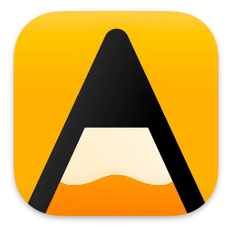
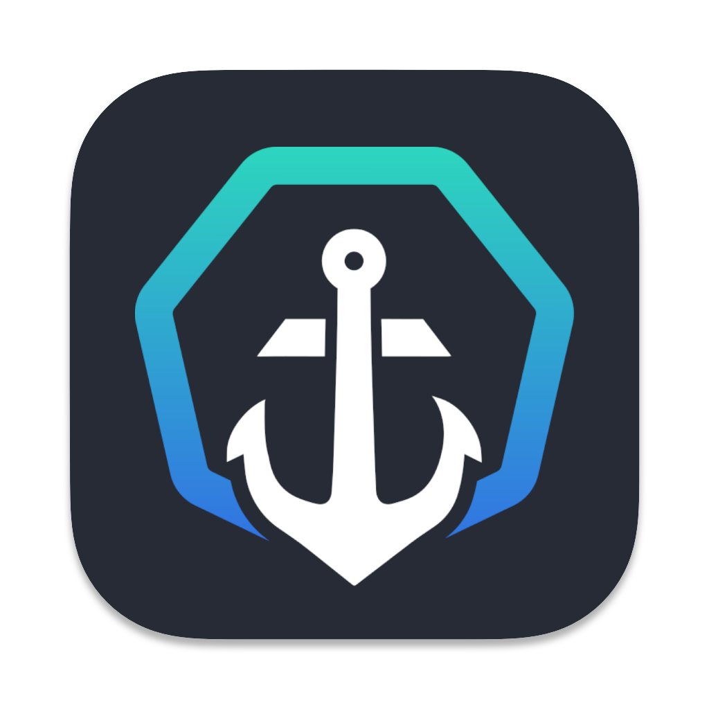
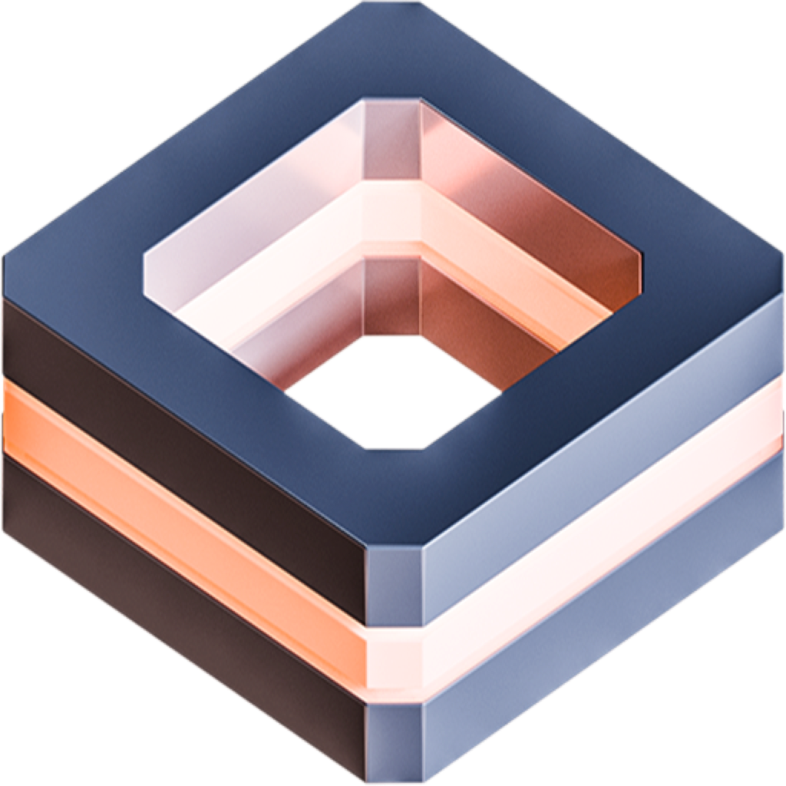
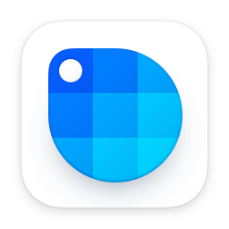

# Perpetual Fallback Licenses

List of software with a perpetual fallback licensing model

### What are perpetual fallback licenses?

With “classic” licenses, customers pay for software upfront and get free updates until a new major version is released. With subscriptions, a customer “rents” software—they pay a monthly or yearly fee and lose access to it when they stop.

A perpetual fallback license is midway between those. A customer gets a period’s worth of updates every time they pay (typically one year), but they’re not forced to keep paying to continue to use the software, as the latest update they had access to will continue to be accessible.

### Software using the perpetual fallback license model

| Icon | Name | Homepage |
| ---- | ---- | -------- |
|  | Agenda | [agenda.com](https://agenda.com/) |
|  | Aptakube | [aptakube.com](https://aptakube.com/) |
|  | Chime | [chimehq.com](https://chimehq.com/) |
|  | Curio | [zengobi.com/curio](https://zengobi.com/curio/) |
|  | DevUtils | [devutils.app](https://devutils.app/) |
|  | Due | [dueapp.com](https://dueapp.com/) |
|  | JetBrains | [jetbrains.com](https://jetbrains.com/) |
|  | MindMac | [mindmac.app](https://mindmac.app/) |
|  | Nova | [nova.app](https://nova.app/) |
|  | Proxyman | [proxyman.io](https://proxyman.io/) |
|  | Quokka | [quokkajs.com](https://quokkajs.com/) |
|  | Ripcord | [cancel.fm/ripcord](https://cancel.fm/ripcord/) |
|  | Screen Studio | [screen.studio](https://screen.studio/) |
|  | Sip | [sipapp.io](https://sipapp.io/) |
|  | Sublime Merge | [sublimemerge.com](https://sublimemerge.com/) |
|  | Sublime Text | [sublimetext.com](https://sublimetext.com/) |
|  | TablePlus | [tableplus.com](https://tableplus.com/) |
|  | Wallaby | [wallabyjs.com](https://wallabyjs.com/) |
